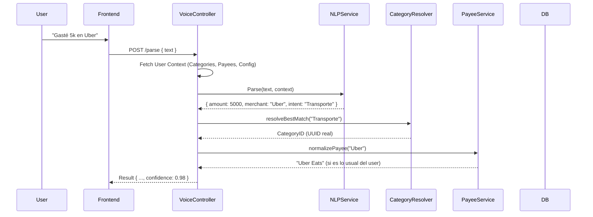

# Plan de Implementación: Transacciones por Voz (Optimizado)

**Estado**: 📋 Planificado (Mejorado v3 - Granular & Seguro)
**Fecha de actualización**: 2025-12-12
**Costo estimado**: $0 USD/mes (usando free tiers)
**Tiempo estimado**: 5-7 días de desarrollo

---

## 📚 Tabla de Contenidos

1. [Estrategia de Desarrollo Seguro (Git Workflow)](#estrategia-de-desarrollo-seguro-git-workflow)
2. [Objetivo y Filosofía "Frictionless"](#objetivo-y-filosofía-frictionless)
3. [Estrategia Técnica: Context-Aware Parsing](#estrategia-técnica-context-aware-parsing)
4. [Arquitectura e Integración Backend](#arquitectura-e-integración-backend)
5. [Flujos de Usuario (UX)](#flujos-de-usuario-ux)
6. [Alcance MVP (Scope)](#alcance-mvp-scope)
7. [Plan de Implementación Detallado](#plan-de-implementación-detallado)
8. [Aprendizaje y Mejora Continua](#aprendizaje-y-mejora-continua)
9. [Roadmap Futuro](#roadmap-futuro)

---

## Estrategia de Desarrollo Seguro (Git Workflow)

Para proteger tu versión estable (`master`), trabajaremos en ramas aisladas por capa lógica. Cada rama debe ser verificada antes de hacer merge.

### Ramas Propuestas

| Rama | Propósito | Dependencia |
| :--- | :--- | :--- |
| `feature/voice-backend-core` | Implementación de servicios, modelos de DB, y lógica de parsing. Sin UI. | Ninguna (base `master`) |
| `feature/voice-frontend-logic` | Hooks de reconocimiento de voz y conexión con API. Sin UI final. | `feature/voice-backend-core` |
| `feature/voice-ui-integration` | Componentes visuales (Botón, Modal, Toast) e integración final. | `feature/voice-frontend-logic` |

### Protocolo de Merge
1.  **Backend Core**: Se integra primero. No afecta al usuario final porque no hay endpoints expuestos en la UI aún.
2.  **Frontend Logic**: Se integra después. Agrega utilidades invisibles.
3.  **UI Integration**: El último paso que "enciende" la funcionalidad para el usuario.

---

## Objetivo y Filosofía "Frictionless"

El objetivo no es solo "hablarle a la app", sino eliminar la fricción de registrar gastos. Pasamos de un modelo "Grabar -> Confirmar -> Guardar" a un modelo **"Hablar -> Listo"**.

### Experiencia Ideal (High Confidence)
1.  Usuario: *"Gasté 5 lucas en el Oxxo en bebidas"*
2.  App: Muestra Toast *"Guardando: Oxxo - $5.000 (Bebidas)"* con cuenta regresiva de 3s.
3.  **Resultado**: Transacción guardada automáticamente sin tocar la pantalla. (Usuario puede tocar "Cancelar" o "Editar" durante la cuenta regresiva).

### Experiencia Estándar (Low Confidence / Ambiguo)
1.  Usuario: *"Gasté 20 mil"* (Falta categoría y comercio)
2.  App: Abre Modal con datos pre-llenados.
3.  Usuario: Completa lo que falta y confirma.

---

## Estrategia Técnica: Context-Aware Parsing

La clave para lograr una alta confianza es no enviar el texto a la IA en vacío, sino inyectarle el **contexto del usuario**.

### Prompt Engineering Dinámico

Al enviar el prompt a GROQ/LLM, incluiremos un "Mini-Snapshot" del estado del usuario:

```json
{
  "user_context": {
    "currency_preference": "CLP",
    "active_categories": ["Comida y Bebidas", "Transporte", "Supermercado", "Casa", "Tech"],
    "recent_payees": ["Uber", "Jumbo", "Starbucks", "Copec", "Oxxo"],
    "common_accounts": ["Banco Estado (Cuenta RUT)", "Santander (Crédito)"]
  },
  "input_text": "Pagué 10 en el jumbo"
}
```

---

## Arquitectura e Integración Backend

Aprovecharemos los servicios robustos que ya existen en tu backend.

### Flujo de Datos Actualizado



### Servicios a Implementar/Modificar

1.  **`VoiceTransactionService`**: Orquestador principal.
2.  **`ContextAssemblyService`**: Recopila categorías activas (usando `CategoryService`), payees frecuentes (de `TransactionService`) y configuración de usuario.
3.  **`SmartMatcherService`**:
    *   Usa algoritmos fuzzy (como Levenshtein) para coincidir texto de la IA con IDs reales de base de datos.
    *   Ejemplo: IA dice "Gasolina" -> Match con categoría "Transporte / Combustible".

---

## Alcance MVP (Scope)

Para garantizar un lanzamiento sólido, simplificaremos la lógica inicial.

### ✅ Incluido en V1 (MVP)
*   Transacciones de **Gastos e Ingresos** personales.
*   Detección automática de **Moneda** (basado en perfil).
*   Detección de **Cuenta** (usando la última usada o default).
*   Parsing de **Fecha** (ayer, hoy, el viernes pasado).
*   **Aprendizaje Básico**: Guardar nuevas palabras clave de comercios.

### ❌ Excluido de V1 (Postergado)
*   **Gastos Compartidos Complejos**: "Pagué yo y divido entre Juan y Pedro". (Demasiada complejidad de IDs de usuarios y lógica de split). Se soportará solo crear el gasto y luego el usuario lo convierte a compartido manualmente si lo desea.
*   **Transferencias entre cuentas**: "Pasa 10k de la cuenta rut a la de ahorro". (Requiere lógica estricta de validación de fondos y cuentas origen/destino).
*   **Upload de archivos de audio**.

---

## Plan de Implementación Detallado

### Fase 1: Backend - Core de Inteligencia (Rama: `feature/voice-backend-core`)

#### Paso 1.1: Configuración e Infraestructura
1.  Crear rama `feature/voice-backend-core` desde `master`.
2.  Instalar dependencias: `npm install sugar-date currency.js`.
3.  Ejecutar migración de DB para tabla `UserTransactionPattern` (Smart Learning).
    *   *Verificación*: `npx prisma db push` exitoso sin afectar otras tablas.

#### Paso 1.2: Servicios de Soporte (Módulos Aislados)
4.  Implementar `ContextAssemblyService`: Método para traer categorías y payees del usuario.
5.  Implementar `SmartMatcherService`: Lógica fuzzy para mapear strings a IDs.
    *   *Verificación*: Crear Test Unitario simple que pase "super" y retorne el ID de "Supermercado".

#### Paso 1.3: Motores de Parsing
6.  Implementar `RuleBasedParser`: Regex para montos y fechas simples.
7.  Implementar `AIParser`: Cliente GROQ con prompt enriquecido.
8.  Implementar `VoiceTransactionService`: Orquestador que llama a los anteriores.

#### Paso 1.4: API Endpoints
9.  Crear `VoiceTransactionController` y rutas.
    *   `POST /api/voice/parse`: Solo devuelve JSON, no crea nada. Seguro de probar.
    *   *Verificación*: Usar Postman/Curl con un texto de prueba y verificar el JSON de respuesta.

**🚩 Hito 1**: Backend listo y probado via Postman. Merge a `master` (o mantener en rama hasta integración final).

---

### Fase 2: Frontend Logic (Rama: `feature/voice-frontend-logic`)

#### Paso 2.1: Hooks y Estado
1.  Crear rama `feature/voice-frontend-logic`.
2.  Implementar `useVoiceRecognition` (Web Speech API).
    *   *Verificación*: Crear una página temporal `/test-voice` que imprima en consola lo que hablas.
3.  Implementar servicio API frontend `voiceTransactionAPI.ts`.

**🚩 Hito 2**: Frontend puede "oír" y comunicarse con el backend, pero sin UI visible para el usuario.

---

### Fase 3: UI Integration (Rama: `feature/voice-ui-integration`)

#### Paso 3.1: Componentes UI
1.  Crear rama `feature/voice-ui-integration`.
2.  Crear `VoiceButton` (Componente visual flotante).
3.  Crear `VoiceFeedbackToast` (Magic Toast con timer).
4.  Crear `VoiceCorrectionModal` (Para casos ambiguos).

#### Paso 3.2: Integración Final
5.  Conectar `VoiceButton` -> `useVoiceRecognition` -> `API` -> `Toast/Modal`.
6.  Conectar acción "Guardar" del Toast con `useCreateTransaction` existente.

**🚩 Hito 3**: Funcionalidad completa visible. Testeo manual exhaustivo (QA).

---

## Aprendizaje y Mejora Continua

Implementaremos una tabla `SmartPatterns` ligera:

| Pattern (Input) | Resolved Category ID | Resolved Merchant | Counter |
| :--- | :--- | :--- | :--- |
| "la tiendita" | [ID de "Snacks"] | "Kiosko Esquina" | 5 |
| "el chino" | [ID de "Hogar"] | "Mall Chino" | 3 |

*   Cada vez que el usuario **corrige** una predicción de la IA, guardamos esa corrección.
*   La próxima vez, buscamos en `SmartPatterns` **antes** de llamar a la IA (Ahorra tokens y mejora velocidad).

---

## Roadmap Futuro

1.  **Soporte Offline**: Cola de sincronización.
2.  **Multilenguaje**: Soportar inglés/portugués dinámicamente.
3.  **Comandos complejos**: "Muéstrame gastos de este mes" (Voice Navigation).
